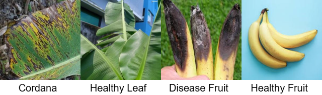
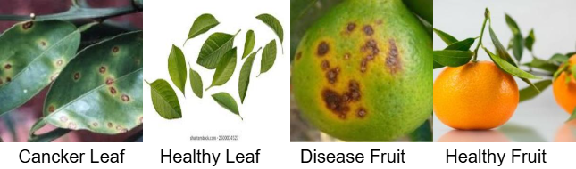
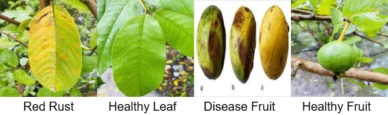
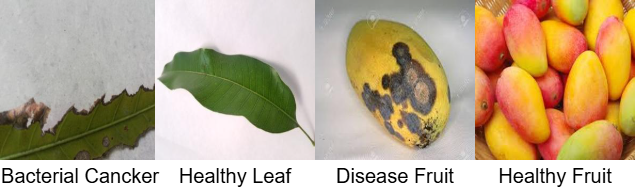
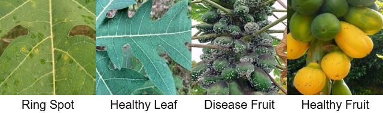

# ABCGMP-Fruit-and-Leaf-Disease-Dataset
# ABCGMP: Multi-Crop Fruit and Leaf Disease Dataset

[](https://doi.org/10.17632/v6p3p7g5z2) 
[](https://creativecommons.org/licenses/by/4.0/)

The **ABCGMP** (Apple, Banana, Citrus, Guava, Mango, and Papaya) dataset is a comprehensive multi-crop image repository for plant pathology research. It addresses the challenge of automated disease detection in diverse agricultural environments by providing high-quality images of both **fruits and leaves**.

Dataset Link: https://data.mendeley.com/datasets/fhbvmpcyy2/2

---

## 📊 Dataset Description

The repository contains samples from six economically vital horticultural crops. The dataset preserves real-world symptom diversity, including fungal, bacterial, and viral manifestations such as:
* **Fruit:** Rot, Scab-like lesions, and Necrotic spots.
* **Leaf:** Spots, Blight, Anthracnose, Red Rust, Canker, and Ring Spot.
* **Apple:** Healthy Fruit, Disease Fruit, Healthy Leaf, Black Rot

* **Banana:** Healthy Fruit, Disease Fruit, Healthy Leaf, Cordana

* **Citrus:** Healthy Fruit, Disease Fruit, Healthy Leaf, Canker Leaf

* **Guava:** Healthy Fruit, Disease Fruit, Healthy Leaf, Black Rot

* **Mango:** Healthy Fruit, Disease Fruit, Healthy Leaf, Bacterial Canker

* **Papaya:** Healthy Fruit, Disease Fruit, Healthy Leaf, Ring Spot

### Data Distribution by Crop and Class

| S.No | Crop | Class | Images | Crop | Class | Images |
| :--- | :--- | :--- | :--- | :--- | :--- | :--- |
| 1 | **Apple** | Healthy Leaf | 2008 | **Guava** | Red Rust | 90 |
| 2 | **Apple** | Black Rot | 1987 | **Guava** | Healthy Leaf | 150 |
| 3 | **Apple** | Healthy Fruit | 301 | **Guava** | Disease Fruit | 160 |
| 4 | **Apple** | Disease Fruit | 286 | **Guava** | Healthy Fruit | 50 |
| 5 | **Banana** | Cordana | 739 | **Mango** | Bacterial Canker | 404 |
| 6 | **Banana** | Healthy Leaf | 535 | **Mango** | Healthy Leaf | 308 |
| 7 | **Banana** | Healthy Fruit | 133 | **Mango** | Disease Fruit | 213 |
| 8 | **Banana** | Disease Fruit | 74 | **Mango** | Healthy Fruit | 348 |
| 9 | **Citrus** | Canker Leaf | 210 | **Papaya** | Ring Spot | 717 |
| 10 | **Citrus** | Healthy Leaf | 192 | **Papaya** | Healthy Leaf | 298 |
| 11 | **Citrus** | Disease Fruit | 158 | **Papaya** | Disease Fruit | 127 |
| 12 | **Citrus** | Healthy Fruit | 190 | **Papaya** | Healthy Fruit | 143 |

### 🌍 Data Sourcing
To ensure robustness against variations in lighting and background, images were sourced as follows:
- **50%:** Direct field acquisition (Uncontrolled conditions).
- **16%:** Crowdsourced from farmers (Smartphone cameras).
- **20%:** Public benchmark datasets.
- **14%:** Verified online agricultural repositories.

---

## 💻 Deep Learning Setup

For training models (such as MDTACNet) on **Kaggle** or **Google Colab**, follow these requirements.

### Hardware Requirements
- **GPU:** NVIDIA Tesla T4, P100, or K80 (Minimum 8GB VRAM).
- **RAM:** 12GB+ (High RAM mode recommended for large Transformer-based models).

### Software & Libraries
```bash
pip install tensorflow torch torchvision opencv-python matplotlib scikit-learn
