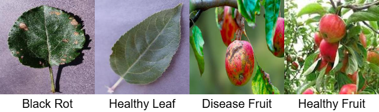

# ABCGMP-Fruit-and-Leaf-Disease-Dataset
# ABCGMP: Multi-Crop Fruit and Leaf Disease Dataset

[](https://doi.org/10.17632/v6p3p7g5z2) 
[](https://creativecommons.org/licenses/by/4.0/)

The **ABCGMP** (Apple, Banana, Citrus, Guava, Mango, and Papaya) dataset is a comprehensive multi-crop image repository for plant pathology research. It addresses the challenge of automated disease detection in diverse agricultural environments by providing high-quality images of both **fruits and leaves**.

Dataset Link: https://data.mendeley.com/datasets/fhbvmpcyy2/2

---

## 📊 Dataset Description

The repository contains samples from six economically vital horticultural crops. The dataset preserves real-world symptom diversity, including fungal, bacterial, and viral manifestations such as:
* **Fruit:** Rot, Scab-like lesions, and Necrotic spots.
* **Leaf:** Spots, Blight, Anthracnose, Red Rust, Canker, and Ring Spot.
* **Apple:** Healthy Fruit, Disease Fruit, Healthy Leaf, Black Rot


### 1. Apple (*Malus domestica*)
* **Healthy Leaf:** Characterized by a uniform green color, smooth margins, and the absence of spots or fungal growth.
* **Black Rot (Leaf):** Also known as "frog-eye" leaf spot; lesions begin as small purple specks that expand into brown spots with distinct purple borders.
* **Healthy Fruit:** Represents the baseline for quality control, showing a smooth skin texture and consistent pigmentation.
* **Disease Fruit (Black Rot):** Manifests as a firm, leathery brown-to-black rot. As decay progresses, it develops concentric rings of black fruiting bodies (pycnidia).
  
* **Banana:** Healthy Fruit, Disease Fruit, Healthy Leaf, Cordana


### 2. Banana (*Musa*)
* **Healthy Leaf:** Large, vibrant green blades without chlorosis or necrotic edges, indicating optimal photosynthesis.
* **Cordana Leaf Spot:** Large, oval-shaped lesions with grayish-brown centers, typically surrounded by bright yellow halos.
* **Healthy Fruit:** Clean yellow or green peels without dark spotting, used to train models on "market-ready" standards.
* **Disease Fruit:** Includes symptoms of fruit rot or anthracnose, characterized by sunken black spots that may coalesce.

* **Citrus:** Healthy Fruit, Disease Fruit, Healthy Leaf, Canker Leaf


### 3. Citrus (*Citrus spp.*)
* **Healthy Leaf:** Glossy, dark green foliage with no signs of mottled yellowing or raised corky textures.
* **Canker Leaf:** Caused by *Xanthomonas citri*; presents as raised, tan-to-brown corky lesions surrounded by an oily, water-soaked margin.
* **Healthy Fruit:** Uniform rind texture and color, essential for differentiating from pathological infections.
* **Disease Fruit:** Exhibits scabby, crater-like lesions that reduce commercial value and lead to fruit drop.

* **Guava:** Healthy Fruit, Disease Fruit, Healthy Leaf, Black Rot


### 4. Guava (*Psidium guajava*)
* **Healthy Leaf:** Clear, matte green surface with a distinct midrib and no signs of algal or fungal growth.
* **Red Rust:** An algal infection appearing as velvety, rusty-orange circular spots on the upper leaf surface.
* **Healthy Fruit:** Smooth, pale green or yellow skin with no indentations or dark necrotic tissue.
* **Disease Fruit:** Shows symptoms of fruit canker or anthracnose, appearing as small, circular, brownish-black spots that may crack.

* **Mango:** Healthy Fruit, Disease Fruit, Healthy Leaf, Bacterial Canker


### 5. Mango (*Mangifera indica*)
* **Healthy Leaf:** Deep green, elongated leaves with a smooth surface and no sign of angular black spots.
* **Bacterial Canker (Leaf):** Water-soaked, angular black lesions limited by leaf veins; can lead to premature leaf fall.
* **Healthy Fruit:** Clear skin with natural lenticels, providing a contrast to diseased samples.
* **Disease Fruit:** Manifests as black, sunken, and often star-shaped cracked lesions that may exude a gummy substance.

* **Papaya:** Healthy Fruit, Disease Fruit, Healthy Leaf, Ring Spot


### 6. Papaya (*Carica papaya*)
* **Healthy Leaf:** Large, palmately lobed leaves with consistent green coloring and no mosaic patterns.
* **Ring Spot (Leaf):** Symptoms include a prominent mosaic pattern, chlorosis, and "shoestring" distortion of the leaf blade.
* **Healthy Fruit:** Smooth, orange-yellow skin (when ripe) without characteristic dark green rings.
* **Disease Fruit:** Defined by dark-green, C-shaped or circular "rings" on the skin that remain visible through ripening.

### 📝 Disease Overview
The dataset covers a wide spectrum of plant pathologies, as summarized below:

| Crop | Disease | Part | Description |
| :--- | :--- | :--- | :--- |
| **Apple** | Black Rot | Leaf/Fruit | Brown rot with concentric rings; purple-rimmed leaf spots. |
| **Banana** | Cordana | Leaf | Large oval lesions with distinct yellow halos. |
| **Citrus** | Canker | Leaf/Fruit | Contagious bacterial corky lesions and necrotic spots. |
| **Guava** | Red Rust | Leaf | Algal-based rusty colored velvety circular spots. |
| **Mango** | Bacterial Canker | Leaf/Fruit | Water-soaked angular spots and star-shaped fruit lesions. |
| **Papaya** | Ring Spot | Leaf/Fruit | Viral mosaic patterns and characteristic fruit rings. |

### Data Distribution by Crop and Class

| S.No | Crop | Class | Images | Crop | Class | Images |
| :--- | :--- | :--- | :--- | :--- | :--- | :--- |
| 1 | **Apple** | Healthy Leaf | 2008 | **Guava** | Red Rust | 90 |
| 2 | **Apple** | Black Rot | 1987 | **Guava** | Healthy Leaf | 150 |
| 3 | **Apple** | Healthy Fruit | 301 | **Guava** | Disease Fruit | 160 |
| 4 | **Apple** | Disease Fruit | 286 | **Guava** | Healthy Fruit | 50 |
| 5 | **Banana** | Cordana | 739 | **Mango** | Bacterial Canker | 404 |
| 6 | **Banana** | Healthy Leaf | 535 | **Mango** | Healthy Leaf | 308 |
| 7 | **Banana** | Healthy Fruit | 133 | **Mango** | Disease Fruit | 213 |
| 8 | **Banana** | Disease Fruit | 74 | **Mango** | Healthy Fruit | 348 |
| 9 | **Citrus** | Canker Leaf | 210 | **Papaya** | Ring Spot | 717 |
| 10 | **Citrus** | Healthy Leaf | 192 | **Papaya** | Healthy Leaf | 298 |
| 11 | **Citrus** | Disease Fruit | 158 | **Papaya** | Disease Fruit | 127 |
| 12 | **Citrus** | Healthy Fruit | 190 | **Papaya** | Healthy Fruit | 143 |

### 🌍 Data Sourcing
To ensure robustness against variations in lighting and background, images were sourced as follows:
- **50%:** Direct field acquisition (Uncontrolled conditions).
- **16%:** Crowdsourced from farmers (Smartphone cameras).
- **20%:** Public benchmark datasets.
- **14%:** Verified online agricultural repositories.

---

## 💻 Deep Learning Setup

For training models (such as MDTACNet) on **Kaggle** or **Google Colab**, follow these requirements.

### Hardware Requirements
- **GPU:** NVIDIA Tesla T4, P100, or K80 (Minimum 8GB VRAM).
- **RAM:** 12GB+ (High RAM mode recommended for large Transformer-based models).

### Software & Libraries
```bash
pip install tensorflow torch torchvision opencv-python matplotlib scikit-learn
